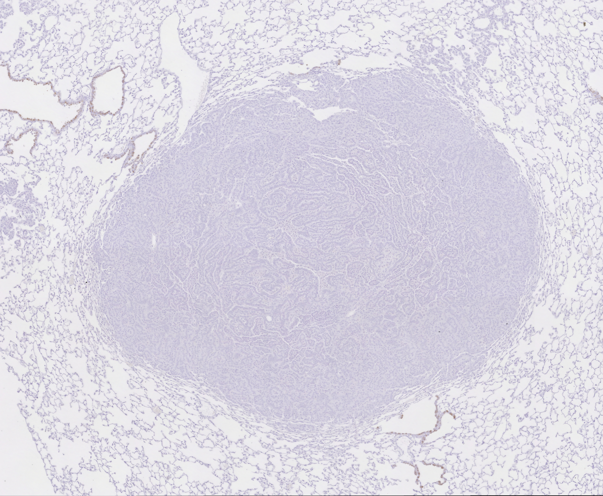

# stain_registration_v2
Accurate registration of multiple whole slide images (WSI) is vital for several pathology tasks
such as joint analysis of various biomarkers and study of tissue morphology to aid in early diagnosis
of diseases, continuous monitoring and patient specific treatment planning. This project investigates
different methods to register immunohistochemical (IHC) stained images to hematoxylin and eosin
(H&E) stained images and evaluates their performance. The methods are tested on a dataset con-
sisting of one set of stains (a total of four images) of serial sections stained with H&E and three IHC
markers (CC10, CD31, and Ki67), along with their corresponding landmark coordinates.
## Dataset
The data set used to test the different methods, consists of four images of consecutive tissue slices, stained
with H&E and three IHC markers, namely CC10, CD31 and Ki67. Each of the images are provided with
associated landmarks denoting key points which are used to evaluate the performance of the registration
methods. 
<div align="center">
	
  
  
  
</div>

## Method
This project implements a combination of intensity and feature based methods and evaluates its performance on the test data based
on mean error (average euclidean distance between registered and true landmarks), k-Pixel threshold error (percentage of pixels for which the registered landmarks is off the
ground truth by more than k pixels) and robustness (percentage of landmarks for which the
euclidean distance between target and source points improved by more than 50% after registration).
The registrations methods used in this work are scale invariant feature transform (SIFT), optical flow and ANTs. The images are preprocessed to normalize the stain using the Reinhard color transformation technique, using the H&E stain as the template.

## Structure
Below is a high-level overview of the project structure:

```
.
├── stain_registration
│   ├── Results
│   │   └── HE_CC10.png
│   │   └── HE_CD31.png
│   │   └── HE_Ki67.png
│   │   └── SIFT_CC10.png
│   │   └── SIFT_CD31.png
│   │   └── SIFT_Ki67.png
│   │   └── antspy_CC10.png
│   │   └── antspy_CD31.png
│   │   └── antspy_Ki67.png
│   │   └── antspy_registered_CC10.png
│   │   └── antspy_registered_CD31.png
│   │   └── antspy_registered_Ki67.png
│   │   └── optical_flow_CC10.png
│   │   └── optical_flow_CD31.png
│   │   └── optical_flow_Ki67.png
│   │   └── optical_flow_registered_CC10.png
│   │   └── optical_flow_registered_CD31.png
│   │   └── optical_flow_registered_Ki67.png
│   ├── TestData
│   │   └── 01-CC10.csv
│   │   └── 01-CC10.jpg
│   │   └── 01-CD31.csv
│   │   └── 01-CD31.jpg
│   │   └── 01-HE.csv
│   │   └── 01-HE.jpg
│   │   └── 01-Ki67.csv
│   │   └── 01-Ki67.jpg
│   │   └── normalized-01-CC10.jpg
│   │   └── normalized-01-CD31.jpg
│   │   └── normalized-01-Ki67.jpg
│   └── evaluation.py
│   └── ants_method.py
│   └── normalize.py
│   └── optical_flow.py
│   └── template_matching_SIFT1.py
│   └── visualization.py
└── LICENSE
└── README.md
└── ants_env.yml
```

-'Results/': Contains results/plot saved from the three methods.

-'TestData/': Contains images and landmarks data used in the project. 

-'evaluation.py': Contains functions to estimate analysis metrics.

-'ants_method.py': Script to run the registration using ANTs method.

-'normalize.py': Script to normaize the IHC images.

-'optical_flow.py': Script to run the registration using opotical flow method.

-'template_matching_SIFT1.py': Script to run the registration using SIFT method.

-'ants_env.yml': Conda environment configuration file.

-LICENSE: License for the project.

-README.md: The file you are currently reading.


## Installation
### Prerequisites

Make sure you have the following installed:

-Anaconda (Recommended)

-Git

### Setup

Clone the repository:
```
git clone https://github.com/argaja10/stain_registration_v2.git
cd stain_registration_v2
```

Create and activate the conda environment:
```
conda env create -f ants_env.yml
conda activate antspy
```

Verify the installation:

Ensure all dependencies are installed and the environment is set up correctly:
```
conda list
```

Install ANTs:
```
pip install antspyx
```

## Usage

First, run the 'normalize.py' file to obtain the stain normalized images of each of the test data image. The normalized image will be automalically stored in TestData folder.
```
cd stain_registration
python normalize.py
```

### Demo run

#### Method 1: SIFT (set flag=0 for CC10 & CD31 marker and flag=1 for Ki67 marker)
```
python template_matching_SIFT1.py --source_path ./TestData/01-HE.jpg --normalized_target_path ./TestData/normalized-01-CC10.jpg --target_path ./TestData/01-CC10.jpg --source_landmarks_path ./TestData/01-HE.csv --target_landmarks_path ./TestData/01-CC10.csv --flag 0
```

#### Method 2: Optical flow
```
python optical_flow.py --source_path ./TestData/01-HE.jpg --normalized_target_path ./TestData/normalized-01-CC10.jpg --source_landmarks_path ./TestData/01-HE.csv --target_landmarks_path ./TestData/01-CC10.csv
```

#### Method 3: ANTs
```
python ants_method.py --source_path ./TestData/01-HE.jpg --normalized_target_path ./TestData/normalized-01-CC10.jpg --source_landmarks_path ./TestData/01-HE.csv --target_landmarks_path ./TestData/01-CC10.csv
```

